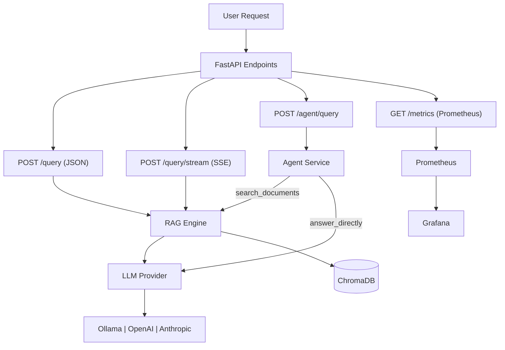

# LocalRAG

Offline-first RAG system. Your documents, your models, your machine.

## What It Is

LocalRAG ingests your local documents, stores embeddings in a local ChromaDB database,
and answers questions using Ollama (or OpenAI / Anthropic) models. No cloud required by default.

### Technical Decisions, In Plain English

If you're new to RAG, this section explains the key design choices and what they mean in practice.

- **Local-first by default:** the happy path runs fully on your machine (`Ollama` + local `ChromaDB`). That means privacy, no mandatory API bills, and easier offline development.
- **Layered API design:** routes are intentionally thin, business logic sits in services, and storage access is behind repository/vector-store adapters. In practice, this keeps changes safer and easier to test.
- **ChromaDB as the vector store:** we chose it because it runs embedded with disk persistence and no separate server setup. Good for laptop workflows, and swappable later via `localrag/storage/vector_store.py`.
- **`nomic-embed-text` as default embeddings:** it gives a strong quality/speed balance for local machines. You can switch models, but rebuilding collections is the expected tradeoff.
- **Structural chunking over blind slicing:** we chunk by meaningful boundaries (headings, tables, code blocks) instead of fixed windows, so retrieval sends complete facts instead of broken fragments.
- **Hybrid retrieval (meaning + exact text):** vector search handles semantic similarity, BM25 handles exact tokens (error codes, SKUs, version strings), and the retriever fuses both so each covers the other's blind spots.
- **Freshness-aware ranking:** newer chunks are favored when content competes on relevance, reducing the common "correct-but-old policy" failure mode.
- **Provider abstraction, not lock-in:** the LLM layer is behind a provider interface (`ollama`, `openai`, `anthropic`), so changing model vendors is mostly configuration and limited wiring.
- **Agent mode is explicit and bounded:** the agent endpoint uses a small tool set (`search_documents` or `answer_directly`) instead of a complex autonomous loop, keeping behavior understandable and debuggable.
- **Evaluation is part of the product, not an afterthought:** there is a bundled eval dataset and repeatable RAGAS run path, so retrieval quality can be measured instead of guessed.

## Architecture



## 5-Minute Quickstart (uv + local Ollama)

1. **Install Ollama** — [ollama.com/download](https://ollama.com/download). See [docs/ollama.md](docs/ollama.md).

2. **Install dependencies:**

```bash
uv sync
```

3. **Start Ollama and pull models:**

```bash
ollama serve
ollama pull nomic-embed-text
ollama pull gemma3:4b
```

4. **Copy the example env file:**

```bash
cp .env.example .env
```

5. **Ingest documents and query:**

```bash
uv run localrag ingest ./docs
uv run localrag query "What are the key topics in these documents?"
```

That's it — no cloud API keys needed for local Ollama mode.

## API

Start the API server:

```bash
uv run uvicorn localrag.api.main:app --reload
```

Open `http://127.0.0.1:8000/docs` for interactive API docs.

### Endpoints

| Method | Path | Description |
| --- | --- | --- |
| `GET` | `/health` | Readiness check (Ollama + ChromaDB) |
| `POST` | `/ingest` | Ingest a single file by server-side path |
| `POST` | `/ingest/directory` | Ingest a directory recursively |
| `POST` | `/ingest/upload` | Ingest a file uploaded via multipart form (browser file picker) |
| `POST` | `/query` | JSON answer with sources and latency |
| `POST` | `/query/stream` | SSE token stream |
| `POST` | `/agent/query` | Agentic RAG (Anthropic tool-use) |
| `GET` | `/metrics` | Prometheus metrics |
| `GET` | `/collections` | List Chroma collections |
| `DELETE` | `/collections/{name}` | Delete a collection |
| `POST` | `/collections/rebuild` | Re-embed all stored sources |

All endpoints except `/health` and `/metrics` require `X-API-Key` when `API_KEY` is set in `.env`.

## Configuration

Copy `.env.example` to `.env` and adjust values:

```bash
cp .env.example .env
```

Key settings:

| Variable | Default | Description |
| --- | --- | --- |
| `API_KEY` | _(empty)_ | Require `X-API-Key` header (leave empty to disable auth) |
| `LLM_BACKEND` | `ollama` | LLM provider: `ollama`, `openai`, or `anthropic` |
| `OLLAMA_BASE_URL` | `http://localhost:11434` | Ollama server URL |
| `OLLAMA_EMBED_MODEL` | `nomic-embed-text` | Embedding model |
| `EMBEDDING_PROVIDER` | `ollama` | Embedding backend: `ollama` or optional `sentence-transformers` |
| `EMBEDDING_MODEL` | _(legacy alias fallback)_ | Provider model; when empty, `OLLAMA_EMBED_MODEL` is used |
| `EMBEDDING_TIMEOUT_SECONDS` | `120` | Embedding request timeout |
| `OLLAMA_LLM_MODEL` | `gemma3:4b` | Chat model for Ollama backend |
| `OPENAI_API_KEY` | _(empty)_ | OpenAI key (required for `openai` backend) |
| `OPENAI_MODEL` | `gpt-4o-mini` | OpenAI model tag |
| `ANTHROPIC_API_KEY` | _(empty)_ | Anthropic key (required for `anthropic` backend or agent) |
| `ANTHROPIC_MODEL` | `claude-haiku-4-5` | Anthropic model tag |
| `CHROMA_PERSIST_PATH` | `./data/chroma` | Where ChromaDB stores vectors |
| `CHROMA_COLLECTION_NAME` | `localrag` | ChromaDB collection name |
| `CHUNKING_MODE` | `structural` | Ingestion chunking mode: `structural` or `fixed` |
| `CHUNK_MAX_CHARS` | `1200` | Max chunk size budget for structural chunking |
| `CHUNK_MIN_CHARS` | `200` | Small-chunk merge floor for structural chunking |
| `RAG_TOP_K` | `5` | Chunks retrieved per query |
| `RETRIEVAL_MODE` | `hybrid` | Retrieval mode: `hybrid` (vector + BM25) or `vector` |
| `BM25_WEIGHT` | `0.5` | Weight for BM25 when non-default weighted fusion is used |
| `RRF_K` | `60` | Reciprocal rank fusion smoothing constant |
| `FRESHNESS_HALF_LIFE_DAYS` | `30.0` | Recency decay half-life; set `0` to disable |
| `UPLOAD_DIR` | `./data/uploads` | Where `POST /ingest/upload` saves multipart uploads |
| `UPLOAD_MAX_BYTES` | `100000000` | Max size accepted by `POST /ingest/upload` |
| `LOG_LEVEL` | `INFO` | Logging level (JSON in production, colored in TTY) |

For structured configuration, start from [`config.example.yaml`](config.example.yaml):

```bash
uv run localrag --config config.yaml ingest ./documents
uv run localrag --config config.yaml config-show
```

Configuration precedence is defaults < YAML < `.env` < process environment <
explicit CLI `--set FIELD=VALUE`. YAML uses strict `embedding`, `retrieval`,
`generation`, `dataset`, and `evaluation` sections, interpolates `${ENV_NAME}`,
and resolves relative paths beside the YAML file. Set `LOCALRAG_CONFIG` when
starting the API, for example `LOCALRAG_CONFIG=./config.yaml uv run uvicorn
localrag.api.main:app`. Existing `.env` names remain supported; the nested YAML
schema is mapped to the same resolved settings model. Secrets stay in the
environment and are redacted by `config-show`.

## CLI

```bash
uv run localrag --help

# Ingest
uv run localrag ingest ./docs
uv run localrag ingest-dir ./docs --recursive

# Query
uv run localrag query "How does chunking work?"

# Eval
uv run localrag eval --offline

# Canonical benchmark matrix (manual; no model work in dry-run)
uv run localrag benchmark --profile fixture --dry-run
uv run localrag benchmark --profile embedding-comparison

# Collections
uv run localrag collections list
uv run localrag collections rebuild

# Read-only local collection diagnostics
uv run localrag inspect --collection localrag --sample-count 5 --format table
uv run localrag inspect --collection localrag --sample-count 20 --format json

# Offline benchmark report (overwrites report.html)
uv run localrag report evals/results/matrices/fixture/manifest.json -o report.html
uv run localrag report --strict run-a.json run-b.json -o report.html
```

## Docker (full stack)

```bash
docker compose up --build
```

Starts: `localrag-api`, `ollama`, `chromadb`, `prometheus`, `grafana`. A one-shot
`localrag-setup` service pulls `OLLAMA_EMBED_MODEL` / `OLLAMA_LLM_MODEL` (via
`uv run localrag setup`, reusing the CLI's own pull logic) before `localrag-api`
starts — no manual `docker exec ... ollama pull` step needed. It exits 0 once
done; that's expected, not a failure.

`docker-compose.override.yml` is merged automatically for local dev — it's
otherwise identical to the base file, plus a bind mount for a Windows-side
folder (WSL2 only) so you can drag-and-drop documents instead of copying them
into the WSL2 filesystem by hand. Edit the path in that file if it doesn't
match your Windows username, or delete the volume line if you don't need it.

Then open:
- API: `http://localhost:8000/docs`
- Grafana: `http://localhost:3000` (admin / admin)
- Prometheus: `http://localhost:9090`

## Evals (RAGAS)

Run the offline evaluation suite against the bundled dataset:

```bash
uv run localrag eval --offline
```

Results are written to `evals/results/`. Evaluation workflows are manually dispatched; no RAGAS run is triggered automatically.

Runs are seeded (`--seed`, default 42) and `--sample N` evaluates a deterministic subset. Datasets are selected from a registry (`--dataset`, `--version`, `--split`; default `localrag-core` `default`) — see [docs/eval-datasets.md](docs/eval-datasets.md). Each result file embeds dataset identity (ID, version, split, content checksum, selected record IDs) and the environment it was produced in — git SHA, model digests, dependency lock hash, hardware, and a settings snapshot — so numbers stay comparable across machines and over time. See [docs/reproducibility.md](docs/reproducibility.md) for the guarantees and their limits.

The canonical matrix runner is invoked manually with `localrag benchmark`. It expands a versioned JSON matrix into stable, ordered case IDs, validates supported dimensions before execution, and writes an isolated manifest under `evals/results/matrices/<matrix_id>/`. `--dry-run` prints the exact expansion without running models. Independent cases continue after failures; a failed case or invalid configuration returns nonzero (`1` for execution failures, `2` for configuration/usage errors). The `fixture` profile is dependency-free, while `embedding-comparison` currently exposes only the installed Ollama `nomic-embed-text` artifact; unavailable E5, BGE, and Jina artifacts are not invented. Matrix JSON is the source contract for future reports and comparisons.

`localrag inspect` is a read-only adapter over the local Chroma filesystem. It reports bounded, sanitized collection metadata and samples as a table or versioned JSON; it does not use API authentication, invoke an LLM, or make network requests. Local filesystem and `.env` permissions are the security boundary. See [docs/cli.md](docs/cli.md) for schemas, limits, and exit codes.

Generate a self-contained report from one or more canonical `ResultFile` evaluation results or `MatrixManifest` benchmark manifests:

```bash
uv run localrag report evals/results/matrices/fixture/manifest.json -o report.html
```

The fixed output is `report.html`; it is overwritten. Inputs are sorted for deterministic output. Invalid files are listed in the report and do not prevent other files from rendering; `--strict` returns exit code 1 after writing the report. Empty input produces an explicit empty report. Runs with different dataset identities are shown but marked incompatible, so scores are not presented as a comparison. Missing and non-finite metrics are `Unavailable`, never zero. The report includes scores, thresholds, status, configuration, case failures, latency, and resources when those fields exist. It contains bundled CSS/JavaScript only and makes no network requests.

Reports omit questions, answers, contexts, and source paths by default. Treat report inputs and displayed metadata as untrusted: content is escaped before display. Do not use reports as a leaderboard or experiment tracker; compare only runs with matching dataset identity, schema contract, and meaningful configuration.

See [docs/evaluation-reports.md](docs/evaluation-reports.md) for the complete output, privacy, compatibility, and interpretation notes.

### Benchmark leaderboard publication

The leaderboard is a deterministic publication layer over reviewed canonical
benchmark artifacts. It does not run models or invent missing results:

```bash
uv run localrag leaderboard sources/*.json --output leaderboard.md --json-output leaderboard.json
```

Incomplete or incomparable artifacts fail clearly; empty input produces an
informative empty table. See [docs/benchmark-leaderboard.md](docs/benchmark-leaderboard.md)
for provenance requirements, methodology, exact identity matrices, update
policy, and comparability limits.

### Benchmark (offline baseline)

The bundled `localrag-core` dataset contains 23 balanced Q/A/context records covering in-scope and out-of-scope cases (`default` split; `smoke` is a 3-record subset). Baseline metrics on the bundled dataset:

| Metric | Target |
| --- | --- |
| faithfulness | ≥ 0.7 |
| answer_relevancy | ≥ 0.7 |
| context_precision | ≥ 0.6 |
| context_recall | ≥ 0.6 |

Run `uv run localrag eval --offline` to get current numbers.

## Retrieval design notes

LocalRAG now defaults to structural chunking, hybrid vector+BM25 retrieval, and
freshness-aware reranking. The details (including ranking math and settings)
live in [docs/rag-retrieval.md](docs/rag-retrieval.md).

## Kubernetes (k3s)

Apply the manifests under `k8s/`:

```bash
kubectl apply -f k8s/configmap.yaml
kubectl apply -f k8s/secret.yaml
kubectl apply -f k8s/deployment.yaml
kubectl apply -f k8s/service.yaml
kubectl apply -f k8s/hpa.yaml
```

Edit `k8s/secret.yaml` to add your actual API keys before applying.

## Development

```bash
uv sync
uv run pytest
uv run ruff check .
uv run ruff format .
uv run mypy localrag/ --ignore-missing-imports --no-strict-optional
```

Install pre-commit hooks:

```bash
uv run pre-commit install
```

See [docs/agent-navigation.md](docs/agent-navigation.md) for codebase navigation and [docs/architecture.md](docs/architecture.md) for the full architecture description.

## Documentation

- [docs/ollama.md](docs/ollama.md) — Installing Ollama
- [docs/architecture.md](docs/architecture.md) — Architecture deep-dive
- [docs/agent-navigation.md](docs/agent-navigation.md) — Fast codebase orientation for agents
- [docs/rag-retrieval.md](docs/rag-retrieval.md) — Retrieval ranking and chunking details
- [docs/issues-and-fixes-reddit-rag.md](docs/issues-and-fixes-reddit-rag.md) — Reddit thread issues mapped to LocalRAG fixes
- [docs/adr/](docs/adr/) — Architecture Decision Records
