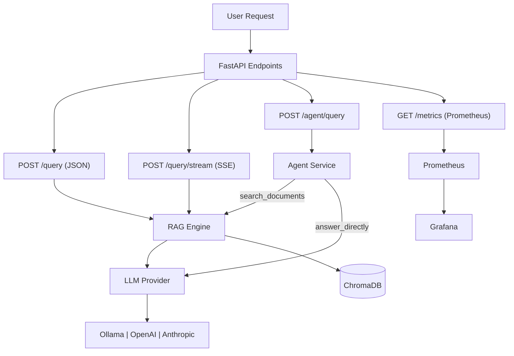

# LocalRAG

Offline-first RAG system. Your documents, your models, your machine.

LocalRAG ingests your local documents, stores embeddings in a local ChromaDB database, and answers questions using Ollama (or OpenAI / Anthropic) models.
No cloud account, no API key, and no data leaving your machine on the default path.

## Why LocalRAG

Most RAG examples are demos: fixed-size text slicing, vector-only search, and no way to tell whether retrieval actually got better.
LocalRAG is built around the parts that decide whether answers are trustworthy.

- **Runs fully offline.** The happy path is Ollama plus embedded ChromaDB on your own hardware — private by construction, no mandatory API bills, and it works on a plane.
- **Chunks by structure, not by character count.** Splitting happens on headings, tables, and code blocks, so retrieved context contains complete facts instead of sentences cut in half.
- **Hybrid retrieval by default.** Vector search finds meaning, BM25 finds exact tokens like error codes, SKUs, and version strings. Each covers the other's blind spot.
- **Prefers fresh answers.** When two chunks are equally relevant, the newer one wins, which avoids the common "correct but out-of-date policy" failure.
- **Measures quality instead of asserting it.** A bundled dataset, RAGAS metrics, a reproducible benchmark runner, and versioned results ship with the project — retrieval changes can be compared, not guessed at.
- **No vendor lock-in.** LLM and embedding providers sit behind interfaces, so switching between Ollama, OpenAI, and Anthropic is configuration rather than a rewrite.
- **Bounded agent mode.** The agent endpoint has exactly two tools (`search_documents`, `answer_directly`) instead of an open-ended loop, so its behavior stays explainable.

## Quickstart

Requires Python 3.13+, [uv](https://docs.astral.sh/uv/), and [Ollama](https://ollama.com/download).

```bash
uv sync --locked

ollama serve
ollama pull nomic-embed-text
ollama pull gemma3:4b

cp .env.example .env

uv run localrag ingest ./docs
uv run localrag query "What are the key topics in these documents?"
```

That's the whole loop — no cloud API keys needed for local Ollama mode.
Ollama install details, including running it in Docker, are in [docs/ollama.md](docs/ollama.md).

### Run the API

```bash
uv run uvicorn localrag.api.main:app --reload
```

Open `http://127.0.0.1:8000/docs` for interactive Swagger documentation of every endpoint, generated from the code itself.
Set `API_KEY` in `.env` to require an `X-API-Key` header on everything except the health and metrics probes.

### Run the whole stack in Docker

```bash
task docker-up
```

Starts `localrag-api`, `ollama`, `chromadb`, `prometheus`, and `grafana`, and pulls the configured models first via a one-shot `localrag-setup` service.
That service exits 0 when it finishes; that is expected, not a failure.

- API: `http://localhost:8000/docs`
- Grafana: `http://localhost:3000` (admin / admin)
- Prometheus: `http://localhost:9090`

## How it works



Documents are parsed, chunked on structural boundaries, embedded, and stored in ChromaDB.
A query retrieves candidates with hybrid search, optionally reranks and compresses them, and passes the surviving context to the answering model.
[docs/architecture.md](docs/architecture.md) covers the layers and data flow in full.

## CLI

```bash
uv run localrag --help

uv run localrag ingest ./docs
uv run localrag query "How does chunking work?"
uv run localrag collections list
uv run localrag inspect --collection localrag --sample-count 5
```

`inspect` is read-only and never calls a model or the network.
Full command reference, JSON schemas, and exit codes: [docs/cli.md](docs/cli.md).

## Configuration

Copy `.env.example` to `.env` and edit it, or use structured YAML:

```bash
uv run localrag --config config.yaml ingest ./documents
uv run localrag --config config.yaml config-show
```

Settings resolve highest-first from CLI `--set`, the environment, `.env`, then YAML — so YAML is a base layer the environment overrides.
Every variable, default, and the full precedence rules are in [docs/configuration.md](docs/configuration.md).

## Evaluation

```bash
uv run localrag eval --offline
```

Results land in `evals/results/`.
Runs are seeded and record dataset identity, git SHA, model digests, and a settings snapshot, so numbers stay comparable across machines and over time.
Evaluation and benchmarks are always manual; nothing triggers a model run in CI.

The bundled `localrag-core` dataset has 23 balanced in-scope and out-of-scope records, with these baseline targets:

| Metric | Target |
| --- | --- |
| faithfulness | ≥ 0.7 |
| answer_relevancy | ≥ 0.7 |
| context_precision | ≥ 0.6 |
| context_recall | ≥ 0.6 |

Benchmark matrices, HTML reports, and the leaderboard are documented in [docs/evaluation-metrics.md](docs/evaluation-metrics.md), [docs/evaluation-reports.md](docs/evaluation-reports.md), and [docs/benchmark-leaderboard.md](docs/benchmark-leaderboard.md).

## Deployment

Kubernetes manifests live in `k8s/`.
The deployment is intentionally single-replica with a `ReadWriteOnce` volume, because Chroma and ingest jobs are node-local; do not apply `k8s/hpa.yaml` until those are externalized.
See [docs/deployment.md](docs/deployment.md) for the persistence, readiness, and trust boundaries.

## Contributing

Setup, tests, quality gates, and the trunk-based Git workflow are in [CONTRIBUTING.md](CONTRIBUTING.md).
[AGENTS.md](AGENTS.md) is the equivalent map for coding agents.

## Documentation

| Document | Contents |
| --- | --- |
| [docs/architecture.md](docs/architecture.md) | Layers, data flow, extension points |
| [docs/configuration.md](docs/configuration.md) | Every setting, default, and precedence rule |
| [docs/cli.md](docs/cli.md) | CLI reference, schemas, exit codes |
| [docs/rag-retrieval.md](docs/rag-retrieval.md) | Ranking math, chunking, retrieval tuning |
| [docs/document-formats.md](docs/document-formats.md) | Supported file types and how each is parsed |
| [docs/ollama.md](docs/ollama.md) | Installing and running Ollama |
| [docs/ocr.md](docs/ocr.md) | Scanned-PDF OCR and Tesseract setup |
| [docs/observability.md](docs/observability.md) | Logging, metrics, optional OpenTelemetry |
| [docs/data-lifecycle.md](docs/data-lifecycle.md) | Upload and query-audit retention |
| [docs/deployment.md](docs/deployment.md) | Compose and Kubernetes contracts |
| [docs/plugin-author-guide.md](docs/plugin-author-guide.md) | Writing a retriever plugin |
| [docs/eval-datasets.md](docs/eval-datasets.md) | Dataset manifests and fixtures |
| [docs/reproducibility.md](docs/reproducibility.md) | Seeding, run metadata, and its limits |
| [docs/agent-navigation.md](docs/agent-navigation.md) | Fast codebase orientation for agents |
| [docs/adr/](docs/adr/) | Architecture Decision Records |
| [docs/research-pipeline-performance.md](docs/research-pipeline-performance.md) | Dated research: stage-by-stage pipeline audit against primary sources |
| [docs/issues-and-fixes-reddit-rag.md](docs/issues-and-fixes-reddit-rag.md) | Dated research: common RAG failure modes mapped to LocalRAG's fixes |
| [ROADMAP.md](ROADMAP.md) | Milestones and contributor guidance |

## License

MIT — see [LICENSE](LICENSE).
