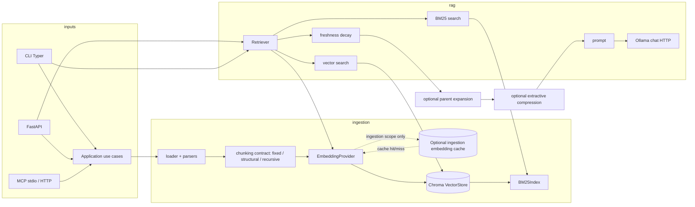

# Architecture

LocalRAG is a small, layered Python package. Most features touch one layer; cross-cutting behavior lives in `localrag/settings.py`, `localrag/logging_config.py`, `localrag/observability/tracing.py`, and `localrag/api/dependencies.py`, with HTTP lifecycle and middleware in `localrag/api/main.py`. Optional OpenTelemetry tracing is disabled by default and never carries content or replaces metrics; see [observability.md](observability.md) and [ADR 030](adr/030-optional-otel-observability-boundary.md). Retriever plugins are the first supported extension family: see [plugin-author-guide.md](plugin-author-guide.md) and [ADR 032](adr/032-retriever-plugin-contract.md).

Configuration is resolved once per execution context by `localrag.settings`: built-in defaults < YAML < `.env` < process environment < explicit CLI `--set` overrides. The API loads `LOCALRAG_CONFIG` during lifespan before cached services are constructed. CLI users pass `--config PATH` before a command. YAML sections (`embedding`, `retrieval`, `generation`, `dataset`, and `evaluation`) map onto the grouped `Settings` model, whose fields stay reachable by their documented flat names ([ADR 037](adr/037-grouped-configuration-model.md)); unknown YAML keys and CLI fields fail fast. YAML-relative paths resolve against the configuration file directory, while environment-only settings retain current-working-directory behavior. Environment interpolation uses `${NAME}`. Secrets are accepted from environment sources and redacted from `config-show` snapshots. See [ADR 020](adr/020-structured-configuration.md).

Deployment has an explicit single-replica contract. Compose binds host ports to
localhost, requires API and Grafana secrets, and keeps observability opt-in;
the API image runs as `localrag` with a read-only root filesystem. Kubernetes
uses a `ReadWriteOnce` PVC for embedded Chroma, a separate Ollama ClusterIP
endpoint, and `/health` versus dependency-aware `/ready` probes. The HPA is
constrained to one replica because Chroma and the in-process job registry are
not shared across pods. See [docs/deployment.md](deployment.md).

The **application layer** (`localrag/application/`) owns transport-neutral DTOs, use cases, errors, jobs, repositories, and runtime factories. The **HTTP API** keeps OpenAPI schemas (`localrag/api/schemas.py`), HTTP error mapping, and thin routers; `localrag/api/service.py` only converts HTTP schemas to application DTOs and responses. The CLI and MCP adapter call the application layer directly. `GET /health` is dependency-free liveness; `GET /ready` checks required Ollama and Chroma dependencies and returns `503` when unavailable. Neither unauthenticated response exposes storage paths or collection names.

## Data flow

  - **Ingest:** files → `loader` / `ingestion/parsers/*` → text → the shared `Chunk` contract (`localrag/ingestion/contract.py`) implemented by fixed, structural, or recursive strategies → the factory-created `EmbeddingProvider` → `VectorStore` (Chroma, persistent path from settings). Contract IDs are deterministic from source, strategy, index, and text; offsets are explicitly absent because current strategies normalize or repack text. Empty input emits no chunks and oversized atomic input is retained with an `oversized` marker. The same provider instance embeds retrieval queries. Collection metadata records provider/model/dimension and rejects incompatible operations; changing the embedding space requires an explicit rebuild. The application ingest use cases in `localrag/application/service.py` own path decode, existence checks, `INGEST_ROOTS`, upload limits, and background jobs; the HTTP adapter maps their DTOs and errors to OpenAPI responses. CLI and MCP calls use the same application use cases directly. See [ADR 021](adr/021-chunking-strategy-contract.md) and [ADR 038](adr/038-application-and-mcp-boundaries.md).
  - **One writer per persist path:** Chroma's embedded client holds HNSW segments in per-process memory with no cross-process invalidation, so concurrent writers from separate processes silently lose writes ([ADR 035](adr/035-atomic-ingestion-replacement.md) already puts them out of contract). `IngestionService.ingest_paths` and `rebuild_collection` therefore take `localrag/storage/persist_lock.py::ingest_lock` — an advisory `flock` on `<CHROMA_PERSIST_PATH>/.ingest.lock` — for the duration of the write; a competing process gets `ConcurrentIngestError` immediately (CLI: stderr message and exit `1`; HTTP: `409 Conflict`). The lock deliberately sits at the ingest use-case boundary rather than inside `VectorStore`, because `api/dependencies.py` and `application/runtime.py` cache a `VectorStore` for the whole process lifetime and a store-scoped lock would let a running API block every CLI ingest forever. Read and query paths are never locked, and an unopenable persist directory or a filesystem without `flock` degrades to a logged warning rather than a hard failure.
- **Rebuild:** `POST /collections/rebuild` and `localrag collections rebuild` list distinct `source` values in the active collection, drop vectors for missing files, and re-chunk/re-embed remaining paths (optional `embed_model` override). Implemented in `IngestionService.rebuild_collection`.
  - **Query (JSON):** `POST /query` returns a complete `QueryResponse` (answer, sources, latency_ms, model) from the application `query_json` use case, adapted by `localrag/api/service.py`. Retrieval supports vector-only and hybrid (vector + BM25 with reciprocal-rank fusion), optional bounded query expansion, then applies optional freshness decay based on chunk `ingested_at`. When `ADAPTIVE_ENABLED=true`, `AdaptiveRetrievalPolicy` performs bounded evidence evaluation/escalation/refinement and adds an observable trace; thresholds are corpus-tuned heuristics, not calibrated confidence. JSON and SSE use the same engine policy path. `RAGEngine` generates the answer via its injected `provider` (a `BaseLLMProvider` built by `llm/factory.py::build_provider`, resilience-wrapped), so `LLM_BACKEND` genuinely governs which backend answers `/query` — it is no longer hard-wired to Ollama. Requires `X-API-Key` when `API_KEY` is set.
- **Query (SSE stream):** `POST /query/stream` streams tokens as Server-Sent Events. Retrieval runs synchronously first (`get_query_contexts`) so errors map to HTTP before SSE starts, then tokens are mapped via `iter_query_sse_events`. Token streaming likewise goes through `RAGEngine.provider.stream_from_prompt(...)`, so `LLM_BACKEND` governs the streaming path too.
- **Metrics:** `GET /metrics` exposes Prometheus metrics via `prometheus_client` (router at `localrag/api/routers/metrics.py`). No auth required.

## Package map

| Area | Path | Role |
| --- | --- | --- |
| Settings | `localrag/settings.py`, `localrag/settings_groups.py`, `localrag/settings_map.py` | Grouped `Settings` model behind flat public names; YAML, `.env`, process env, and CLI override sources, plus redacted grouped/flat snapshots |
| Logging | `localrag/logging_config.py`, `localrag/api/middleware.py` | `configure_logging()`, stderr handler on `localrag.*`, `X-Request-ID` on HTTP requests |
| Application layer | `localrag/application/` | Transport-neutral DTOs, use cases, errors, jobs, collection repository, and runtime factories |
| API wiring | `localrag/api/dependencies.py` | FastAPI dependency wrappers for vector store, embedding provider, BM25 index, retriever, RAG engine, ingestion service, and collection repository |
| HTTP API (transport) | `localrag/api/main.py`, `localrag/api/routers/*` | Lifespan (`configure_logging`), `RequestContextMiddleware` (`X-Request-ID`), global exception + validation handlers + `HttpMappedError`; thin route handlers |
| HTTP API (contracts) | `localrag/api/schemas.py` | Pydantic request/response models and path aliases (OpenAPI) |
| HTTP API (adapter) | `localrag/api/service.py` | Maps OpenAPI schemas to application DTOs and application responses back to HTTP models |
| MCP adapter | `localrag/mcp/` | FastMCP tool surface over stdio and `/mcp` HTTP; no business rules |
| API key auth | `localrag/api/dependencies.py` | `require_api_key` dependency — enforces `X-API-Key` when `API_KEY` env var is set |
| Prometheus metrics | `localrag/api/routers/metrics.py` | `GET /metrics` via `prometheus_client.generate_latest()` |
| Application persistence | `localrag/application/repository.py` | `ChromaCollectionRepository` → `VectorStore` for collection list/delete |
| Background ingest jobs | `localrag/application/jobs.py` | `JobRegistry` — in-memory `ThreadPoolExecutor`-backed job store for background ingest; no persistence across process restarts |
| CLI | `localrag/cli/app.py`, `localrag/cli/commands/*`, `docs/cli.md` | `localrag` Typer entry (`pyproject` `[project.scripts]`); `inspect` is read-only local diagnostics and `benchmark` delegates to `evals.matrix.run_matrix` |
| Ingestion orchestration | `localrag/ingestion/service.py` | `IngestionService`: paths → parse → chunk → embed → upsert |
| File formats | `localrag/ingestion/parsers/*` | pdf (Markdown extraction via pdf-inspector, with OCR fallback via pypdfium2 + pytesseract), docx, markdown, text, code |
| Embedding | `localrag/embedding/`, `localrag/ingestion/embedder.py` | Provider protocol/factory, Ollama **`POST /api/embed`**, optional sentence-transformers backend, collection identity checks, and the disabled-by-default provider-aware ingestion vector cache |
| Embedding cache | `localrag/embedding/cache.py` | Versioned hashed vector-only disk entries, atomic writes, process/thread locking, checksum validation, bounded LRU cleanup, and fail-open cache I/O |
| Storage | `localrag/storage/vector_store.py` | Chroma client wrapper |
| Ingest ownership lock | `localrag/storage/persist_lock.py` | `ingest_lock` — advisory `flock` on `<persist_path>/.ingest.lock` giving one process exclusive write ownership of a Chroma persist path; fails fast with `ConcurrentIngestError` |
| RAG | `localrag/rag/retriever.py`, `bm25_index.py`, `engine.py`, `prompt.py` | Hybrid retrieval (vector + BM25), freshness decay reranking, prompt build, LLM call |
| Retriever plugins | `localrag/plugins/retriever.py`, `docs/plugin-author-guide.md` | Versioned `localrag.retrievers` entry points; deterministic selection and lifecycle ownership |
| Context compression | `localrag/rag/compressor.py` | Disabled-by-default deterministic extractive compression after parent expansion; preserves retrieval provenance and hard token/character budgets |
| Ollama API models | `localrag/ollama/schemas.py` | Pydantic types + `parse_ollama_json` / `parse_ollama_json_line` for outbound requests and responses |
| LLM abstraction | `localrag/llm/` | `BaseLLMProvider`, Ollama/OpenAI/Anthropic providers, factory, cost estimator |
| Agent | `localrag/agent/service.py`, `localrag/api/routers/agent.py` | Anthropic tool-use agent; `POST /agent/query` |
| Eval | `evals/dataset/`, `evals/metrics.py`, `evals/concurrency.py`, `evals/run_evals.py`, `evals/matrix.py`, `evals/results/`, `evals/compare.py`, `evals/report.py`, `evals/leaderboard.py` | Dataset registry + deterministic/RAGAS metrics, bounded evaluation orchestration, canonical matrix runner, versioned result contract/comparison, offline HTML rendering, and strict leaderboard publication; `localrag eval`, `localrag benchmark`, `localrag eval-compare`, `localrag report`, and `localrag leaderboard` CLI commands |
| Late-interaction research | `evals/late_interaction.py`, `research/late_interaction_spike/` | Dependency-free MaxSim/index correctness spike and fixture evidence; isolated from Chroma and the default retriever; see ADR 027 |
| RAPTOR research | `research/raptor_spike/` | Dependency-free hierarchical summary/provenance/persistence/retrieval feasibility spike; isolated from Chroma and default retrieval; see ADR 028 |
| Audit log | `localrag/audit.py` | `write_audit_record` — bounded local JSONL trail with rotation, retention, metadata-only, and redaction modes; disabled by default via `AUDIT_LOG_PATH` |
| Optional tracing | `localrag/observability/tracing.py` | Lazy OpenTelemetry setup, safe allowlisted attributes, sampling, context propagation, and fail-open lifecycle |

## LLM abstraction
`localrag/llm/` decouples the RAG engine from a specific model API:

| Path | Role |
| --- | --- |
| `localrag/llm/providers/base.py` | `BaseLLMProvider` ABC with `generate(prompt, context)` / `stream(...)` (context-list contract for direct scripting use) and `generate_from_prompt(prompt)` / `stream_from_prompt(prompt)` (already-built-prompt contract used by `RAGEngine`) |
| `localrag/llm/types.py` | `LLMResponse` dataclass (answer, model, tokens_used, latency_ms, estimated_cost_usd) |
| `localrag/llm/providers/ollama.py` | Ollama HTTP provider (default, local) |
| `localrag/llm/providers/openai_provider.py` | OpenAI chat completions |
| `localrag/llm/providers/anthropic_provider.py` | Anthropic messages API |
| `localrag/llm/resilience.py` | `ResilientProvider` — retry-with-backoff (tenacity) + circuit breaker (pybreaker) wrapping any `BaseLLMProvider` (including the `*_from_prompt` methods); optional fallback provider on sustained failure |
| `localrag/llm/factory.py` | `build_provider(settings)` — selects provider by `LLM_BACKEND` env var; always returns a `ResilientProvider`-wrapped instance |
| `localrag/llm/costs.py` | `estimate_cost_usd(model, tokens)` with prefix-match price table |

`RAGEngine` (`localrag/rag/engine.py`) holds a `provider: BaseLLMProvider` field (injected in `localrag/api/dependencies.py::get_engine` via `build_provider(settings)`) and builds its own citation-rich prompt with `localrag.rag.prompt.build_prompt`, then calls `self.provider.stream_from_prompt(prompt, model=model)` — it no longer talks to Ollama's `/api/chat` directly, so switching `LLM_BACKEND` to `openai` or `anthropic` actually changes what answers `/query` and `/query/stream`.

## Embedding abstraction

`localrag/embedding/` defines the provider-neutral single and batch contract.
`build_embedding_provider` selects Ollama by default or the optional
sentence-transformers backend. Ingestion and `Retriever` receive the same
cached instance. Chroma metadata records provider, model, and vector dimension;
an incompatible runtime fails before vector operations. See [ADR 019](adr/019-embedding-provider-contract.md).
The optional `EmbeddingCache` is used only by ingestion and never stores source
metadata or text. Its key and local storage contract are documented in [ADR 024](adr/024-embedding-cache-contract.md).

## Agent layer

`localrag/agent/service.py` exposes `run_agent(question, engine, api_key, model)`:

1. Calls `anthropic.messages.create(tools=[search_documents, answer_directly])`.
2. Inspects the `ToolUseBlock` in the response content.
3. For `search_documents`: calls `engine.answer()` and packages sources.
4. For `answer_directly`: returns the agent's answer verbatim.

The `reasoning` field records which path was taken. The router in `localrag/api/routers/agent.py` returns HTTP 503 when `ANTHROPIC_API_KEY` is absent.

## Eval system

`evals/run_evals.py` runs deterministic EM/F1, annotation-backed citation accuracy, hallucination rate, and the existing RAGAS metrics against a registered dataset (`--dataset`/`--version`/`--split`, default `localrag-core` `default`). Results write to `evals/results/` with dataset identity, a content checksum, selected record IDs, per-case status/counts, and environment provenance embedded. The CLI command `uv run localrag eval --offline` delegates to this script. See [docs/evaluation-metrics.md](evaluation-metrics.md), [docs/eval-datasets.md](eval-datasets.md), [docs/reproducibility.md](reproducibility.md), and [evaluation ADRs 011-017](adr/011-evaluation-dataset-contract.md).

`evals/matrix.py` is the canonical cross-configuration benchmark contract. `uv run localrag benchmark` validates and expands versioned dimensions into stable case IDs, runs cases in isolated artifact directories, records structured failures, and continues independent cases. The existing single-run evaluator remains the adapter seam; reports must consume the matrix JSON rather than define another schema. `evals/tracking.py` is an optional best-effort MLflow mirror with a provider-neutral lifecycle boundary; local JSON remains authoritative and tracking is disabled by default. See [ADR 018](adr/018-optional-mlflow-experiment-tracking.md).

`evals/report.py` consumes `MatrixManifest` and `ResultFile` directly and writes one deterministic, self-contained `report.html`. It deliberately omits raw document content and source paths, surfaces malformed inputs and missing values, and marks incompatible dataset identities instead of comparing them. The report is a local inspection view, not experiment tracking or leaderboard publication.

`evals/leaderboard.py` is the strict publication adapter. It validates the
provenance-rich leaderboard artifact contract, rejects incompatible or missing
rows, orders exact model identities deterministically, and writes Markdown plus
optional JSON without running benchmark work. See [benchmark-leaderboard.md](benchmark-leaderboard.md) and [ADR 017](adr/017-strict-leaderboard-publication.md).

Dockerized benchmark execution is an integration adapter, not another evaluator.
The smoke profile uses `scripts/docker_benchmark.py` with the registered dataset,
`evals.matrix.run_matrix`, and `evals.results.schema.ResultFile`; real CPU/GPU
profiles add pinned Ollama/Chroma services and a readiness/model-digest gate.
Results and matrix/per-case artifacts are exported under `evals/results/docker/`.
See [ADR 033](adr/033-dockerized-benchmark-boundary.md).

## Extension points

- **New file type:** add a parser under `localrag/ingestion/parsers/`, register it via `loader` / parser dispatch (see `localrag/ingestion/loader.py`).
- **PDF OCR behavior:** edit `localrag/ingestion/parsers/pdf.py` and the `OCR_*` settings in `localrag/settings.py`; see [ocr.md](ocr.md) for the Tesseract install requirement.
- **Chunking behavior:** edit `localrag/ingestion/contract.py`, the selected strategy (`chunker.py`, `structural_chunker.py`, or `recursive_chunker.py`), and related knobs in `localrag/settings.py`; see [ADR 021](adr/021-chunking-strategy-contract.md).
- **New transport surface:** add or reuse a use case in `localrag/application/`, then add only transport-specific DTO/error mapping and a thin adapter. HTTP schemas belong in `localrag/api/schemas.py`; MCP tools belong in `localrag/mcp/`.
- **New CLI command:** new module under `localrag/cli/commands/`, register in `localrag/cli/app.py`.
- **New config:** field on `Settings` in `localrag/settings.py`, document in `.env.example`, use via `get_settings()`.
- **Retrieval ranking:** modify `localrag/rag/retriever.py` and `localrag/rag/bm25_index.py` for fusion/decay behavior.
- **Retriever plugin:** use the public contract in `localrag/plugins/retriever.py`; install a pinned distribution exposing `localrag.retrievers` and select `retriever_plugin`.
- **Stricter ingest policy:** adjust checks in `localrag/application/service.py` (`ingest_file` / `ingest_directory`) and/or `is_path_allowed` in `localrag/settings.py`.

## Tests

Tests live under `tests/` (`conftest.py` sets a quiet default `LOG_LEVEL` for pytest). Many cases use stubs or HTTP mocks (e.g. Ollama via respx); run with `uv run pytest`.
